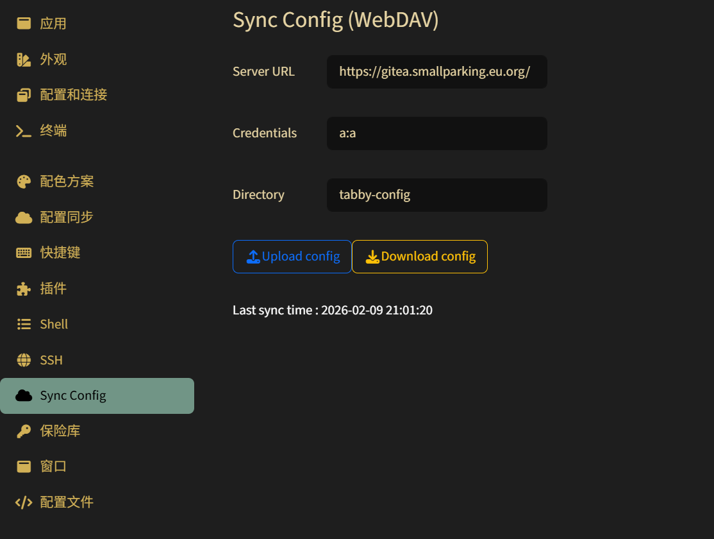

# Sync Config

### For the [Tabby](https://github.com/Eugeny/tabby) terminal

This plugin can sync configuration files to GitHub Gist, Gitee Gist, GitLab Snippets, or WebDAV servers.

---

## Supported Backends

### GitHub Gist
Sync your Tabby configuration to GitHub Gist.

**Setup:**
1. Select "GitHub" as the Type
2. Generate a personal access token at https://github.com/settings/tokens with `gist` scope
3. Enter the token and sync

### Gitee Gist
Sync your Tabby configuration to Gitee Gist (China-friendly).

**Setup:**
1. Select "Gitee" as the Type
2. Generate a private token at https://gitee.com/profile/personal_access_tokens
3. Enter the token and sync

### GitLab Snippets
Sync your Tabby configuration to GitLab Snippets.

**Setup:**
1. Select "GitLab" as the Type
2. Enter your GitLab instance URL (e.g., https://gitlab.com or your self-hosted URL)
3. Generate a personal access token at Settings → Access Tokens
4. Enter the token and sync

### WebDAV
Sync your Tabby configuration to any WebDAV-compatible server (Nextcloud, ownCloud, NAS, etc.).

**Setup:**
1. Select "WebDAV" as the Type
2. Enter your WebDAV server URL:
   - Nextcloud: `https://cloud.example.com/remote.php/dav/files/username`
   - ownCloud: `https://cloud.example.com/remote.php/webdav`
   - Generic: `https://webdav.example.com/dav`
3. Enter credentials in the format `username:password`
   - The credentials will be base64 encoded for Basic Auth
   - You can also use pre-encoded base64 credentials
4. Enter a directory name (optional, defaults to auto-generated)
5. Sync

**Supported WebDAV Servers:**
- [Nextcloud](https://nextcloud.com)
- [ownCloud](https://owncloud.com)
- [Seafile](https://www.seafile.com)
- [Synology NAS](https://www.synology.com)
- [QNAP NAS](https://www.qnap.com)
- Any standard WebDAV server

---

## Features

- **Multiple Backends**: Support for GitHub, Gitee, GitLab, and WebDAV
- **Self-Hosted Support**: GitLab and WebDAV work with your own servers
- **Encryption**: Option to encrypt SSH passwords with your token before storing
- **Easy Setup**: Simple configuration through Tabby settings UI
- **Automatic Sync**: One-click upload and download

---

Like my work?

